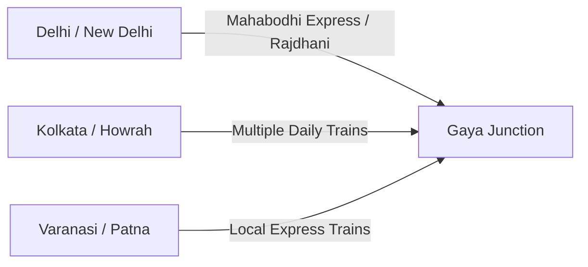

## Introduction: Planning Your Sacred Pilgrimage

Planning a trip to the ancient city of **Gaya, Bihar**, to perform ancestral rites (*Pind Daan* or *Shraddha*) is a major event for Hindu families. While the spiritual aspect is the focus, the practical logistics of travel, route coordination, and local transport are crucial to ensure a smooth, stress-free experience, especially when traveling with elderly relatives.

Gaya is a well-established pilgrimage center and is highly connected by rail, road, and air. However, choosing the wrong transit routes, landing at distant airports without pre-booked transport, or failing to understand the local city traffic can lead to fatigue and delays.

This guide provides a comprehensive breakdown of **How to Reach Gaya for Pind Daan** — covering flights, trains, road networks, and practical local transit tips within the city to help you coordinate a comfortable pilgrimage.

---

## 1. Reaching Gaya by Air (Flight Routes)

For domestic and international travelers, flying is the most comfortable option, especially when accompanied by senior citizens. There are two primary airports you can choose:

### Option A: Gaya International Airport (GAY)
*   **Location:** Located within Gaya district, approximately 10 kilometers from the Vishnupad Temple and 5 kilometers from Bodhgaya.
*   **Domestic Flights:** Indigo and Air India operate direct flights connecting Gaya to major hubs like **New Delhi, Kolkata, and Mumbai**.
*   **International Flights:** Seasonal flights (especially from October to March) connect Gaya directly to Southeast Asian countries (Bangkok, Singapore, Sri Lanka, Yangon) due to Bodhgaya's Buddhist pilgrimage traffic.
*   **Pros:** The closest and most convenient airport. Minimizes local road transit.
*   **Cons:** Limited daily flight schedules and higher seasonal fares.

### Option B: Jayprakash Narayan International Airport, Patna (PAT)
*   **Location:** Located in the state capital, Patna, approximately 105 kilometers north of Gaya.
*   **Flight Connectivity:** Extremely well-connected to all major Indian cities with multiple daily flights from Delhi, Mumbai, Bengaluru, Hyderabad, Chennai, and Kolkata.
*   **Road Transit to Gaya:** After landing in Patna, you can hire a private AC cab to Gaya. The road journey takes approximately **2.5 to 3 hours** via the NH 83 highway.
*   **Pros:** Highly reliable schedules, lower fares, and numerous flight options.
*   **Cons:** Requires a 3-hour road journey to reach Gaya.

---

## 2. Reaching Gaya by Train (Rail Routes)

The railway network is the lifeline of Gaya's pilgrimage traffic. **Gaya Junction (GAY)** is one of the most prominent railway stations in the East Central Railway zone and is directly connected to almost all major Indian cities.

### Key Rail Connections:
*   **From New Delhi (approx. 12 - 15 hours):** The *Mahabodhi Express* (runs daily directly from New Delhi to Gaya) and various Rajdhani or Duronto expresses traveling to Kolkata or Patna stop at Gaya Junction.
*   **From Kolkata (approx. 6 - 8 hours):** Numerous daily trains connect Howrah/Sealdah to Gaya, making it a very quick and popular rail route.
*   **From Mumbai / Western India (approx. 24 - 30 hours):** Multiple weekly trains connect Mumbai (CST/LTT) to Gaya, though many travelers prefer flying to Patna and taking local trains/cabs.
*   **From Southern India:** Connecting trains run weekly from Chennai, Bengaluru, and Hyderabad.

*Tip for Peak Seasons:* During the **Pitra Paksha Mela** (September–October), Indian Railways runs special *Pitra Paksha Mela Trains* from various parts of India. Bookings open 120 days in advance; ensure you book early as trains run at full capacity.

---

## 3. Reaching Gaya by Road (National Highways)

Gaya is well-connected by road, with wide highways linking it to neighboring cities.

*   **From Patna (105 km):** Connected via **NH 83**. The road is a well-maintained four-lane highway, making the journey comfortable and scenic.
*   **From Varanasi (250 km):** Connected via **Grand Trunk Road (NH 19)**. The drive takes approximately 5 to 6 hours. Many pilgrims combine their Kashi (Varanasi), Prayagraj, and Gaya pilgrimages by road.
*   **From Ranchi (170 km):** Connected via **NH 99**, a pleasant 4-hour drive through hilly terrains.

---

## 4. Local Transit: Navigating Within Gaya City

Once you arrive in Gaya, navigating the local temples and ghats requires coordination:

*   **Auto-Rickshaws:** The most popular and practical mode of transport within the city. Because the streets leading to the Vishnupad Temple and Falgu River are narrow, cars are often restricted. Auto-rickshaws can navigate these lanes easily. A full-day hire costs approximately ₹800 - ₹1,200.
*   **Private Cabs:** Highly recommended if you are visiting the outlying Vedis like **Pretshila Hill** (8 km away), **Ramshila Hill** (5 km away), or Bodhgaya. A private AC cab costs approximately ₹1,800 - ₹2,500 per day.
*   **E-Rickshaws (Totos):** Environmentally friendly, quiet, and cheap. Excellent for short distances between the railway station, hotels, and the main temple entrance.

---

## Summary Table: Travel Options at a Glance

| Travel Mode | Origin / Details | Approximate Transit Time | Best Suited For |
| :--- | :--- | :--- | :--- |
| **Direct Flight (GAY)** | Delhi, Kolkata, Mumbai | 1.5 - 2 Hours | Families with senior citizens; VIP travelers. |
| **Patna Flight + Cab** | All Indian Cities | 2 Hrs flight + 3 Hrs drive | Devotees seeking flexible flight schedules. |
| **Express Train (GAY)** | Delhi, Kolkata, Varanasi | 6 - 15 Hours (depending on origin) | Budget-conscious travelers and family groups. |
| **Road Trip (Cab)** | Varanasi, Ranchi, Patna | 3 - 6 Hours | Devotees combining Varanasi, Prayagraj, and Gaya. |

---

## Conclusion and Booking Support

Having a clear understanding of **How to Reach Gaya for Pind Daan** ensures that your physical journey is comfortable, allowing your mind to remain focused on the spiritual duties towards your ancestors.

At **Gaya Rituals**, we provide complete travel and transit coordination:
*   We arrange clean, verified **AC Cab Pickups** directly from Patna Airport or Gaya Junction railway station.
*   We manage local transport between your hotel, Falgu River, Vishnupad Temple, Akshay Vat, and the hill Vedis (Pretshila/Ramshila).
*   We arrange dharamshala/hotel lodging close to the main temple complex to minimize commute times.

**Ready to book your end-to-end travel and ritual coordination?**

[Book Your Ritual Now](/book-pind-daan-gaya) | [Talk to a coordinator on WhatsApp](/contact) | [Read the Complete Pind Daan Guide](/blog/pind-daan-in-gaya-complete-guide)
