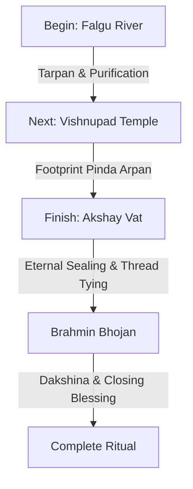

## Introduction: The Spiritual Gravity of Pind Daan

Performing **Pind Daan in Gaya** is one of the most sacred duties a Hindu descendant can undertake. The *Garuda Purana* and *Vayu Purana* explain that this ancient ritual is a gateway to eternal salvation (*Moksha*) for departed ancestors. By satisfying their spiritual hunger and thirst, families can resolve inherited karmic blocks known as *Pitru Dosha*, clearing path for peace, health, and prosperity in their own lives.

However, because the ritual is highly systematic and rooted in ancient Vedic science, the protocol matters. A ceremony performed with incorrect methods, on inappropriate days, or guided by unqualified individuals can dilute the spiritual efficacy of your offerings, leaving the ancestors unsatisfied. 

This guide details the most common **Pind Daan mistakes** pilgrims make when planning or performing rituals in Gaya, and provides practical advice on how to avoid them for a smooth, authentic, and spiritually successful pilgrimage.

---

## 1. Choosing the Wrong Dates and Astrological Windows

In Vedic tradition, timing (*Muhurat*) is everything. The spiritual portal to the ancestral dimension (*Pitru Loka*) opens at specific times of the year, driven by lunar cycles and planetary transits. A common mistake is planning the trip based solely on convenience without checking the lunar calendar.

### Performing Rites on Incorrect Tithis
A *Tithi* is a lunar day in the Hindu calendar. Vedic Shradh is ideally performed on the exact Tithi on which the ancestor departed, not the Gregorian calendar date. 
*   **The Mistake:** Performing the ceremony on a random day, or guessing the tithi.
*   **The Correction:** Consult family elders or a verified priest beforehand to calculate the correct Hindu tithi of passing. If the exact tithi is completely unknown, perform the ritual on **Sarvapitri Amavasya** (the final new moon day of Pitru Paksha), which serves as a universal gateway for all ancestors.

### Misunderstanding Pitru Paksha Tithi Exceptions
While Pitru Paksha is the supreme fortnight for ancestral rites, certain tithis carry strict rules:
*   **Matru Navami (9th Tithi):** Dedicated specifically to deceased mothers, grandmothers, and wives. Performing general rites on this day while ignoring female ancestors is a lost opportunity.
*   **Chaturdashi Tithi (14th Tithi):** Historically reserved *only* for ancestors who met with sudden, violent, or unnatural deaths (accidents, weapons, poison). Performing normal Shradh on this day for ancestors who died of natural causes is scripturally discouraged and is considered a significant Pind Daan mistake.

For a detailed analysis of dates, read our guide on the [Best Time for Pind Daan in Gaya](/blog/best-time-for-pind-daan-in-gaya).

---

## 2. Incomplete Rituals: Skipping the Core Vedis

Gaya is a sacred matrix of spiritual energy spots known as **Vedis** (sacred platforms). While there are up to 45 traditional Vedis scattered across the region, scriptures mandate a minimum of three specific locations to seal the liberation process.

### Skipping the Falgu River (Phalgu Nadi)
*   **The Mistake:** Going straight to the Vishnupad Temple inner sanctum without performing Tarpan (water offerings) at the riverbank.
*   **Why it matters:** The Falgu River is where Mata Sita offered the first sand pindas to King Dasharatha. Bathing and performing Tarpan here purifies the Karta (the performer) and quenches the ancestors' spiritual thirst. Skipping this step makes the subsequent food offerings incomplete.

### Ignoring Akshay Vat (The Immortal Banyan Tree)
*   **The Mistake:** Leaving Gaya immediately after offering Pindas on the footprint at Vishnupad Temple.
*   **Why it matters:** Akshay Vat is the final station. The Banyan tree is immortal, and offering Pindas here ensures that the merit of the ritual becomes *Akshaya* (inexhaustible and permanent). Tying the sacred Mauli thread here seals the lineage connection, ensuring the soul does not return to wander in earthly attachments.

### Complete Vedi Requirements:
Ensure your package covers the **3 Core Vedis** at a minimum:
1.  **Falgu River Ghats:** For Snan (purification) and Tarpan.
2.  **Vishnupad Temple:** For placing Pindas on Lord Vishnu's footprint.
3.  **Akshay Vat:** For the final, permanent sealing of the merit.

For a step-by-step procedure breakdown, check out the [Pind Daan in Gaya Complete Guide](/blog/pind-daan-in-gaya-complete-guide).

---

## 3. Choosing Unverified Guides and Temple Touts

One of the most stressful aspects of a pilgrimage to Gaya is the presence of unauthorized guides, local touts, and aggressive agents at the railway station and temple gates. Falling into their hands is a major mistake that can ruin the spiritual focus of your trip.

### The "Voluntary Donation" Dakshina Trap
*   **The Mistake:** Agreeing to a very low initial fee with a random priest at the ghats, only to be pressured during the final *Sankalp* (vow) to donate massive sums of money, gold, or cows.
*   **Why it happens:** Some unauthorized priests use psychological pressure during the sacred vow, claiming that the ancestor's soul will remain trapped in hell if the family does not donate a specific amount. Out of guilt and fear, devotees pay exorbitant amounts.
*   **How to avoid:** Book your ritual through a transparent platform like **Gaya Rituals**. Establish an all-inclusive, fixed price beforehand. Ensure the priest is informed that the agreed-upon dakshina is the final payment.

### Working with Non-Gayawal Pandits
*   **The Mistake:** Hiring a priest who does not belong to the hereditary **Gayawal Panda** community.
*   **Why it matters:** Only the Gayawal Pandas possess the scriptural authority and access to the ancient family registry books (*Bahi Khatas*). These books record the visits of your ancestors going back centuries. A non-Gayawal priest cannot verify your family lineage or register your visit, making the ritual generic and scripturally deficient.

| Feature | Hereditary Gayawal Panda | Unauthorized Local Tout / Priest |
| :--- | :--- | :--- |
| **Lineage Registry** | Yes (Physical Bahi Khatas verified) | No access to family records |
| **Scriptural Authority** | Hereditary rights granted by Lord Vishnu | None (often perform brief, invalid rites) |
| **Pricing** | Standardized, transparent through networks | Low initial bait with heavy hidden demands |
| **Location Access** | Authorized access to inner sanctums | Often restricted to outer temple areas |

---

## 4. Skipping or Underestimating the Brahmin Bhojan

According to the *Manusmriti* and the *Garuda Purana*, a Shradh ceremony is not complete until Vedic Brahmins are fed and satisfied. 

*   **The Mistake:** Thinking that placing Pindas at the temple is enough, and skipping the feeding of priests to save time or money.
*   **The Scriptural Reality:** The ancestors are believed to receive the essence of the food through the physical intake of a satvik Brahmin. If the priests leave hungry or unsatisfied with the dakshina, the ritual is considered incomplete (*Asampurna*).
*   **The Correction:** Budget both time and money to feed a minimum of 2 to 5 Brahmins traditional satvik food (puri, sabzi, kheer, dal, rice) and offer them a decent, respectful Dakshina alongside a new piece of white cloth.

---

## 5. Dress Code and Footwear Violations

The temples of Gaya are active, high-vibrational energy fields with strict rules. Devotees often make minor mistakes that lead to embarrassment or exclusion from the inner sanctums.

*   **Wearing Leather Items:** Do not wear leather belts, wallets, or watch straps inside the Vishnupad Temple or near the ritual platforms. Leather is made from animal hide and is strictly prohibited in sacred spaces. Use fabric wallets or keep your belongings in a cloth bag.
*   **Inappropriate Clothing:** Men must wear traditional unstitched clothing like a white dhoti-kurta. Women must wear simple sarees or salwar suits. Avoid wearing black, dark brown, or bright neon colors.
*   **Barefoot Navigation:** The entire temple and ghat areas are barefoot zones. During summers, the stone floors can become extremely hot. A common mistake is not preparing for this. *Tip:* Look for the damp jute carpets laid down by the temple administration, or schedule your rituals for the early morning hours (6:00 AM – 9:00 AM) before the sun heats the stone.

---

## 6. Going Without Written Ancestor Records

When the Pandit begins the *Sankalp* (sacred vow), you will be asked to recite the names of your ancestors. 

*   **The Mistake:** Relying on memory in a crowded, noisy environment. It is easy to forget names, confuse relationships, or forget the Gotra under pressure.
*   **The Correction:** Write down all details on a sheet of paper (or in your phone's notes app) before arriving in Gaya. Make sure you have:
    - Your Gotra (family lineage name)
    - Full names of three generations of paternal ancestors (father, grandfather, great-grandfather)
    - Full names of three generations of maternal ancestors (mother, grandmother, great-grandmother)
    - Approximate year or lunar date (Tithi) of passing for each

---

## Summary Checklist to Avoid Pind Daan Mistakes

To ensure your pilgrimage to Gaya is flawless and spiritually rewarding, keep this checklist in mind:

- [ ] **Verify the Tithi:** Consult a priest or calendar to match the death dates with the correct lunar days.
- [ ] **Book a Gayawal Panda:** Ensure your priest is a verified member of the hereditary Gayawal community.
- [ ] **Confirm 3 Core Vedis:** Check that your package includes Falgu River, Vishnupad Temple, and Akshay Vat.
- [ ] **Fix the Price:** Agree on a transparent, all-inclusive price covering materials, pandit fees, and Brahmin Bhojan before starting.
- [ ] **Pack Traditional Attire:** Bring clean white dhotis/kurtas and simple traditional wear. Avoid leather.
- [ ] **Write Down Names:** Keep a physical sheet with names, relationships, and Gotras ready for the Sankalp.

---

## Conclusion: Fulfill Your Duty with Peace and Clarity

Avoiding these common **Pind Daan mistakes** is key to preserving the spiritual sanctity of your ancestral rites. When done correctly, the ritual brings deep emotional relief and releases ancestral karmas, unlocking blessings for your family.

At **Gaya Rituals**, we understand the complexity and spiritual weight of these ceremonies. We connect you directly with verified Gayawal Pandits, ensure transparent all-inclusive pricing, coordinate transport between the 3 core Vedis, and arrange authentic Brahmin Bhojan.

**Ready to plan a flawless, scam-free Pind Daan?**

[Book Your Ritual Now](/book-pind-daan-gaya) | [Talk to a coordinator on WhatsApp](/contact) | [Learn About Pind Daan Costs](/blog/pind-daan-in-gaya-cost)
