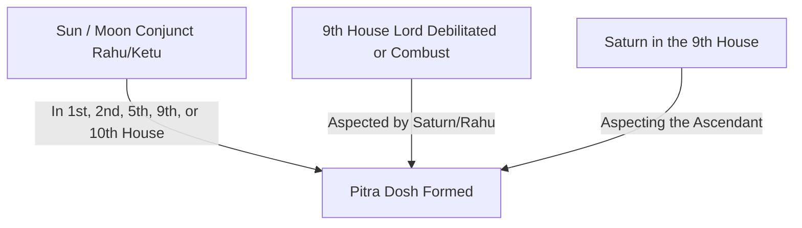

## Introduction: The Invisible Burden of Lineage Karma

In the Vedic tradition, our lives are not just shaped by our individual choices and actions (*Prarabdha Karma*), but also by the spiritual and genetic lineage we inherit. Just as we inherit physical features, genetic predispositions, and family assets, we also inherit the spiritual and karmic records of our ancestors.

When the departed souls of our ancestors (*Pitrus*) are in a state of unrest — either due to sudden, accidental deaths, unfulfilled desires, or the neglect of proper funeral and Shradh rites — it manifests as a spiritual block in the family line. In Vedic astrology, this condition is known as **Pitra Dosh** (or *Pitru Dosha*).

Pitra Dosh is not a "curse" in a magical sense; it is a karmic debt that remains unpaid by the lineage. The supreme, scripturally mandated center to resolve this debt is **Gaya, Bihar**. This guide explains how Pitra Dosh is identified in a horoscope, its physical symptoms in daily life, and how specialized **Pitra Dosh Remedies Gaya** rituals can permanently resolve the affliction.

---

## Astrological Signs: How is Pitra Dosh Identified in a Horoscope?

A qualified Vedic astrologer identifies Pitra Dosh by analyzing the houses and planets representing parents and ancestors in a birth chart (*Kundali*).

### Key Astrological Configurations:
1.  **Sun and Moon Conjunct Rahu or Ketu:** The Sun represents the father, soul, and ancestors; the Moon represents the mother and emotions. When either is conjunct with or aspected by Rahu or Ketu in the **1st, 2nd, 5th, 9th, or 10th houses**, it indicates severe ancestral distress.
2.  **Afflicted 9th House:** The 9th house is the *Pitru Sthana* (the house of father and ancestors). If the lord of the 9th house is debilitated, combust, or conjunct with Saturn or Rahu, the lineage carries unresolved karmic blockages.
3.  **Saturn in the 9th House:** Saturn is the planet of karma and delay. Its placement in the house of ancestors indicates that ancestral obligations have been neglected for generations.

---

## Physical Symptoms: How Pitra Dosh Manifests in Daily Life

Even if you do not have access to your birth chart, Pitra Dosh manifests in a family's daily life through distinct, repetitive symptoms:

*   **Obstacles in Progeny (Vansh Vistar):** Unexplained delays in conceiving children, repeated miscarriages, or health complications during pregnancy without medical causes.
*   **Delays in Marriage:** Siblings in the family experiencing repeated setbacks or cancellations in marriage proposals despite being qualified and willing.
*   **Financial Stagnation and Debt:** Persistent financial losses in business, lack of savings, or sudden wealth drain despite hard work and talent.
*   **Lack of Family Harmony:** Constant, exhausting arguments and friction between couples, parents, and siblings without valid reasons.
*   **Hereditary Health Issues:** Recurring, chronic diseases passing down generations, or family members meeting with frequent accidents.

---

## Why Gaya is the Supreme Center for Pitra Dosh Remedies

While minor remedies can be performed at home, scriptures like the *Garuda Purana* state that a complete, permanent resolution to Pitra Dosh is only possible at a designated *Mukti Dham* (land of liberation). 

**Gaya is the supreme center for these remedies because:**
*   **The Boon of Gayasur:** Lord Vishnu pressed the demon Gayasur into the earth here and promised that any soul for whom rituals are performed in Gaya will attain permanent liberation.
*   **The Footprint of Vishnu (Vishnupad):** Placing offerings on the basalt footprint of Lord Vishnu inside the Vishnupad Temple acts as a spiritual solvent, dissolving the ancestor's remaining karmic ties (*Karma Bandhana*).
*   **Lineage Registry (Bahi Khata):** The hereditary Gayawal Pandas maintain records of family visits going back centuries, ensuring the ritual is personalized to your exact lineage.

---

## The Three Specialized Pujas in Gaya for Pitra Dosh

Depending on the severity of the symptoms and the astrological configuration, three specific rituals are conducted:

### 1. Narayan Bali Puja (Untimely / Unnatural Deaths)
If a family member met with an accidental, sudden, or violent death (suicide, accident, murder, poisoning), the soul is trapped in the spirit state (*Preta*).
*   **The Ritual:** A highly specialized 2-day puja involving the creation of a symbolic grass body, a sacred Havan, and footprint arpan to release the soul.
*   **Read more:** [Narayan Bali Puja in Gaya: Benefits and Procedure](/blog/narayan-bali-puja-gaya-benefits-procedure).

### 2. Tripindi Shraddha (Multi-Generational Satisfaction)
If ancestral rites have been neglected for multiple generations, or the names of the ancestors are unknown.
*   **The Ritual:** A 1-day puja where three distinct Pindas made of sugar, wheat, and sesame are offered to satisfy all categories of ancestors.
*   **Read more:** [Tripindi Shraddha in Gaya: Complete Ritual Guide](/blog/tripindi-shraddha-gaya-ritual-guide).

### 3. Comprehensive Gaya Pind Daan (Standard Liberation)
To satisfy the general paternal and maternal lineage and secure their permanent blessings.
*   **The Ritual:** A 1-day or 2-day pilgrimage covering the 3 Core Vedis (Falgu River, Vishnupad Temple, Akshay Vat).
*   **Read more:** [Pind Daan in Gaya: Complete Step-by-Step Guide](/blog/pind-daan-in-gaya-complete-guide).

---

## Summary of Pitra Dosh Remedies in Gaya

| Remedy Type | Duration | Best Time to Perform | Primary Benefit |
| :--- | :--- | :--- | :--- |
| **Narayan Bali** | 2 Days | Pitru Paksha, Amavasya, Eclipses. | Releases souls from accidental or sudden deaths. |
| **Tripindi Shraddha** | 1 Day | Any auspicious day. | Resolves multi-generational neglect and blocks. |
| **Gaya Pind Daan** | 1 Day | Pitru Paksha, Winter Amavasya. | Secures permanent salvation for maternal/paternal lines. |

---

## Conclusion and Booking Support

Resolving **Pitra Dosh Remedies Gaya** is not an act of fear, but one of deep gratitude and respect for your lineage. By performing these scripturally guided rituals, you act as a spiritual savior for your ancestors, unlocking their blocks and inviting their blessings of health, prosperity, and harmony into your life.

At **Gaya Rituals**, we understand the spiritual weight of these remedies. We coordinate with verified Astrologers and Gayawal Pandas to analyze your birth chart, identify the correct puja, manage the Havan setups, and ensure a smooth, scam-free pilgrimage.

**Ready to resolve Pitru Dosha in Gaya?**

[Book Your Ritual Now](/book-pind-daan-gaya) | [Speak to a coordinator on WhatsApp](/contact) | [Read the Complete Pind Daan Guide](/blog/pind-daan-in-gaya-complete-guide)
